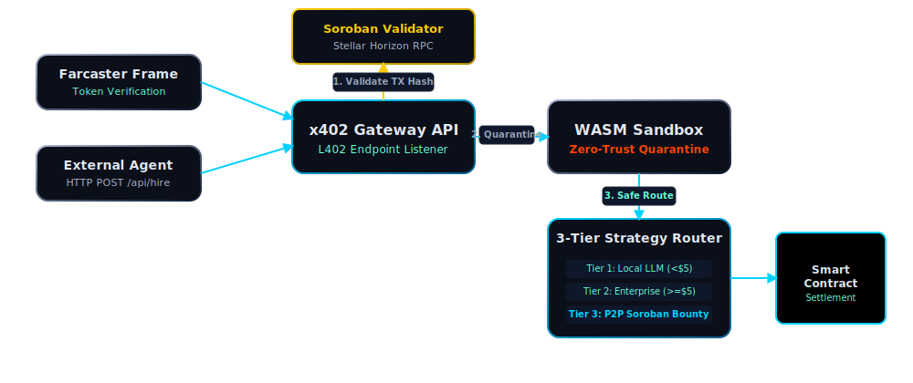

<div align="center">
  
  
  <br/><br/>
  
  <h1>x402 Arbitrage Mesh</h1>
  <p><strong>We didn't build an AI agent. We built the immune system for all of them.</strong></p>
  <p><em>Autonomous Inter-Agent Payment Routing Protocol on Soroban & Extism / DoraHacks 2026</em></p>
  
  [](https://x402-arbitrage-mesh.vercel.app/)
  [](https://github.com/Triarchy-Labs/x402-arbitrage-mesh/actions)
  
  <br/>
  <a href="#quick-start">Quick Start</a> •
  <a href="#architecture">Architecture</a> •
  <a href="#security">Security</a> •
  <a href="#demo">Demo</a>
</div>

<br/>

/// MODULE: THE ALPHA PITCH

Most submissions build a single AI agent trying to complete a task. **We built the infrastructure to host them all safely.** 

DeFi is bleeding because smart contracts trust external Oracles and AI agents blindly. If Agent A hires Agent B, how do you know Agent B won't return a malicious payload that drains the contract? 

**The x402 Arbitrage Mesh is a Zero-Trust Sovereign Gateway:**
1. External agents pay us via **Stellar Soroban (L402 Protocol)**.
2. We drop untrusted AI payloads into an isolated **WASM Sandbox (Extism WASI 0.2)**.
3. If the payload is clean, we route it (Local LLM → Sovereign Node → P2P). If it's malicious, we kill it before it touches the host OS.

/// PROBLEM VECTOR

The current AI agent ecosystem is fragmented: agents are isolated, overwhelmed nodes drop tasks, and there is **no trust layer** between agents exchanging work. When Agent A delegates a task to Agent B, how do you know Agent B's response isn't malicious?

/// SOLUTION VECTOR: x402 ARBITRAGE MESH

The **x402 Arbitrage Mesh** is a decentralized **Load Balancer + Payment Router + Security Firewall** for AI Agents, built natively on the Stellar Network using the **HTTP 402 (Payment Required)** protocol.

We solve three profound problems simultaneously:
1. **Routing Strategy** — Intelligent 3-tier task dispatch (Local Micro-Bounty → Enterprise Node → P2P Mercenary Delegation).
2. **Financial Settlement** — Autonomous USDC micropayments via Soroban on Stellar Testnet preventing free-riding.
3. **Defense-in-Depth Security** — Zero-trust WASM sandbox quarantine intercepting hostile payloads before OS execution.

### /// CAPABILITIES [ ECOSYSTEM ]
Our Mesh is not just a firewall; it is a full-fledged economic engine for autonomous entities:
- **P2P Task Delegation & Arbitrage:** An overwhelmed agent can instantly sub-contract tasks to idle external agents across the Mesh, splitting the Soroban bounty for instant profit.
- **x402 Subscription Mode:** Consumers can transition from pay-per-prompt (L402) to high-volume "Subscription Sub-Agents" (e.g., establishing a $5,000 streaming channel for continuous high-compute task delegation), managed entirely via our Agent Registry.
- **Farcaster Token-Gated Entry:** Humans can only access the Mesh gateway dashboard if they hold specific ERC20 tokens, authenticated via Neynar + Viem Multicall.

### /// AESTHETIC: SOVEREIGN MATRIX UI
We believe infrastructure dashboards shouldn't look like spreadsheets. We built a rigorous, **Awwwards-class cinematic interface** for the Sovereign Gateway:
- **Lusion-Grade Particle Engine:** Custom GLSL fragment shaders with `linearStep + fwidth()` hardware-perfect antialiasing, depth-aware softness computed from camera distance, and Simplex Noise-driven motion.
- **ScreenPaint Fluid Simulation:** FBO ping-pong 2D fluid dynamics — swipe or cursor movement physically displaces particles like liquid (Lusion Labs pattern, `pushStrength=25`, `velocityDissipation=0.985`).
- **SMAA Post-Processing:** Subpixel Morphological Anti-Aliasing replaces 4x MSAA, saving ~75% GPU framebuffer memory on mobile devices.
- **Physics-Inertial Cursor:** A magnetic Framer-Motion driven custom cursor seamlessly inverts background colors using `mix-blend-mode: difference`.
- **Hyper-Terminal Bootloader:** Matrix-style fast boot sequencing before mounting the DOM.
- **Theme Adapters:** Full dynamically shifting "Cyberpunk Dark" to "Premium Ascetic White" themes injected straight into WebGL contexts.

---

/// [ INTER-SWARM COLLABORATION ] 
**We didn’t build this to crush the competition; we built this to protect it.** 
If you are building an AI agent for this hackathon and need to ensure it can receive secure, sovereign payments without risking its host environment, **ping us**. We will help you route your agent through the x402 Mesh. We want to elevate the entire ecosystem's execution standard to absolute sovereign security. The Triarchy is open for collaboration.

---

/// MODULE: ARCHITECTURE

<div align="center">
  
</div>

### How It Works

1. **An external AI agent** sends `POST /api/hire` with a task description, bounty amount, and a Stellar transaction hash in the `x-l402-txhash` header.
2. **The Gateway validates the payment** by fetching the transaction from Stellar Horizon RPC, checking the memo, destination wallet, and USDC amount.
3. **The payload is quarantined** in an Extism WASM sandbox (WASI 0.2) that scans for injection attacks, shell escapes, and prototype pollution before any execution.
4. **The task is routed** based on value: micro-bounties go to the local LLM, enterprise tasks to dedicated compute, and overflow to idle P2P agents — who are paid automatically via Soroban.

---

/// MODULE: ZERO-TRUST QUARANTINE {#security}

This is our **core differentiator**. Every payload from an untrusted external agent passes through a zero-trust quarantine:

| Layer | Technology | Purpose |
|-------|-----------|---------|
| L1 | Extism Plugin (WASI 0.2) | Deep binary analysis in isolated sandbox |
| L2 | Heuristic Fallback | Token-based scan (30+ banned patterns) |
| L3 | ReplayGuard | 5-min TTL prevents double-spending of payment signatures |
| L4 | SpendingPolicy | Per-caller allowlist/blocklist + per-call/daily/global budget caps |
| L5 | SSRF Protection | Blocks localhost, private subnets (10.x, 172.16-31, 192.168), IPv6 |
| Lock | `allowedPaths: {}`, `allowedHosts: []` | No filesystem or network access for plugins |

```typescript
// From src/lib/wasm_sandbox.ts
const plugin = await createPlugin("./plugins/quarantine.wasm", { 
  useWasi: true,
  allowedPaths: {},  // Zero filesystem access
  allowedHosts: []   // Zero network access
});
```

### Payment Security Pipeline
```
Request → ReplayGuard (txHash dedup) → SpendingPolicy (budget check) → WASM Quarantine → Route
```
- **ReplayGuard** — Each `txHash` can only be used once. 5-minute TTL with automatic cleanup.
- **SpendingPolicy** — 5-level enforcement: allowlist → blocklist → per-call max → per-caller daily → global daily cap.
- **SSRF Protection** — `isAllowedUrl()` blocks all private/internal network ranges on external fetches.

**Why this matters (WASM vs Docker):** Several other Hackathon solutions attempt to sandbox AI agents using Docker containers. Docker is a legacy virtualization paradigm that is too heavy (consuming Megabytes of RAM) and too slow (milliseconds to seconds of cold start latency) for high-frequency AI micro-bounties. 

We use **WebAssembly (Extism WASI 0.2)**. Our cold starts are measured in *microseconds*. We deliver an absolute, lightweight execution quarantine before the malicious payload ever has a chance to touch the host OS. In the AI economy, speed and zero-trust are everything.

---

/// MODULE: DEPLOYMENT SEQUENCE {#quick-start}

### Prerequisites
- Node.js 18+
- (Optional) Ollama for local LLM execution

### 1. Clone and Install
```bash
git clone https://github.com/Triarchy-Labs/x402-arbitrage-mesh.git
cd x402-arbitrage-mesh
cp .env.example .env.local
npm install
```

### 2. Start the Gateway
```bash
npm run dev
```
Navigate to `http://localhost:3000` — you'll see the real-time GPU-accelerated telemetry feed visualizing agent communication.

### 3. Test the x402 Flow {#demo}
```bash
# Step 1: Hit the endpoint without payment → get 402 
curl -X POST http://localhost:3000/api/hire \
  -H "Content-Type: application/json" \
  -d '{"description":"Summarize this paper","bounty_usdc":"2.50"}'
# Response: 402 Payment Required

# Step 2: Include payment proof → task executes
curl -X POST http://localhost:3000/api/hire \
  -H "Content-Type: application/json" \
  -H "x-l402-txhash: YOUR_STELLAR_TESTNET_TX_HASH" \
  -d '{"description":"Summarize this paper","bounty_usdc":"2.50","client_id":"demo_agent"}'
# Response: 200 OK with task result
```

### 4. Test the WASM Security
```bash
# Send a malicious payload → blocked by quarantine
curl -X POST http://localhost:3000/api/hire \
  -H "Content-Type: application/json" \
  -H "x-l402-txhash: demo_tx" \
  -d '{"description":"system(rm -rf /)","bounty_usdc":"1.00","client_id":"attacker"}'
# Response: 403 Forbidden — payload quarantined
```

### 5. (Optional) P2P Delegation Demo
```bash
node dummy_external_bot.js  # Start mock mercenary agent on port 3001
# Now submit a task < $5 — watch it delegate to the external agent
```

---

/// STRUCTURE VECTOR

```
x402-triarchy-gateway/
├── src/
│   ├── app/
│   │   ├── api/
│   │   │   ├── hire/route.ts    # Core L402 endpoint — 6-stage pipeline
│   │   │   └── mcp/route.ts     # MCP discovery manifest for AI agents
│   │   ├── bounties/page.tsx    # Bounty board UI
│   │   ├── dashboard/page.tsx   # Sovereign command matrix
│   │   ├── layout.tsx           # App shell with SEO metadata
│   │   └── page.tsx             # GPU-accelerated landing page
│   ├── components/
│   │   ├── LiquidGlassShader.tsx  # WebGL particle system (Lusion fwidth AA + SMAA)
│   │   ├── ScreenPaint.tsx        # FBO fluid mouse simulation (Lusion Blueprint §5)
│   │   ├── RefractiveCore.tsx     # Refractive glass icosahedron
│   │   └── HollywoodTelemetry.tsx # Real-time terminal feed
│   ├── hooks/
│   │   └── useUnifiedPointer.ts   # Unified touch/mouse input normalizer [-1,1]
│   └── lib/
│       ├── soroban.ts             # Stellar Horizon RPC validator
│       ├── wasm_sandbox.ts        # Extism WASI 0.2 quarantine
│       ├── replay-guard.ts        # Anti-replay protection (5-min TTL)
│       ├── spending-policy.ts     # Budget enforcement (5-level caps)
│       ├── security.ts            # SSRF protection + budget degradation
│       ├── xrpl-transactor.ts     # XRPL bridge (optional)
│       └── agent_registry.ts      # In-memory agent stats tracker
├── .github/workflows/ci.yml    # CI: TypeScript + ESLint + Semgrep + Build
├── docs/AUDIT_FINALIST_ASSIMILATION.md  # Security audit report
├── src-tauri/                   # Tauri v2 desktop wrapper (optional)
├── .env.example                 # Environment variables reference
└── dummy_external_bot.js        # Mock P2P mercenary agent
```

---

/// COMPANION: FARCASTER TOKEN GATE

The Mesh includes a **Farcaster Frame** entry point that implements ERC20 token gating:
- Resolves Farcaster FID → Ethereum addresses via **Neynar API**
- Checks token balance via **Viem Multicall** (single RPC request)
- Grants access to the Gateway for authorized holders

Repository: [farcaster-token-gate](https://github.com/Triarchy-Labs/farcaster-token-gate)

---

/// MODULE: ENVIRONMENT CONFIGURATION

See [`.env.example`](.env.example) for the full list. Key variables:

| Variable | Description | Default |
|----------|-------------|---------|
| `STELLAR_PLATFORM_WALLET` | Your Stellar wallet for receiving USDC | Required |
| `OPENROUTER_API_KEY` | OpenRouter API key for production LLM routing | Required |
| `OLLAMA_URL` | Local Ollama URL (Mark 53 desktop only) | — |
| `ENTERPRISE_THRESHOLD` | USD threshold for enterprise routing | `5.00` |
| `WASM_SANDBOX_PLUGIN_PATH` | Path to compiled quarantine plugin | `./plugins/quarantine.wasm` |
| `DYNAMIC_ROUTING_FEE` | Platform fee percentage | `0.05` |
| `LOCAL_EXECUTION_HOOK` | Local execution endpoint for queue check | — |

---

/// THE TRIARCHY CYBER-STACK

This platform was engineered from the ground up to establish absolute sovereign security for the Agentic Web. We deployed an uncompromising, multi-disciplinary tech stack representing thousands of lines of hardware-accelerated, zero-trust architecture.

| Architectural Layer | Core Technologies | Subsystems & Focus |
|---------------------|-------------------|--------------------|
| **Core Desktop Node** | `Tauri v2`, `Rust` | Sovereign OS Wrapper, Local IPC, Native System Daemon |
| **Zero-Trust Execute**| `Extism WASI 0.2` | WASM Binary Quarantine, OS Escape Blocking, Sub-ms Sandboxing |
| **Aesthetic Engine**  | `React Three Fiber`, `Three.js`| GPGPU 16K Particle System (FBO Ping-Pong), Simplex 4D Curl Noise, Scroll-Reactive Wind |
| **Stellar Economy**   | `Soroban`, `L402 Protocol` | Smart Contract Task Verification, Horizon RPC, USDC Bounties |
| **Identity Gateway**  | `Neynar API`, `Viem Multicall` | Farcaster Frame Gating, Deep ERC20 Wallet Validation |
| **Frontend Matrix**   | `Next.js 16.2.2`, `React 19.2.4`| React Server Components (RSC), Edge Runtime, TailwindCSS 4 |
| **Motion Physics**    | `Framer Motion 12`, `Lenis` | Inertial smooth scrolling, Multi-blend magnetic cursors |
| **Agent Swarm L0**    | `MCP Paradigm`, `Systemd L0` | Inter-Agent Communication Loop, Autonomous Daemon Recovery |

---

/// MODULE: VERIFICATION STACK

Every commit passes through our 14-instrument automated verification pipeline, organized in three tiers:

**Tier 1 — Static Analysis & Build**

| # | Instrument | What It Checks |
|---|-----------|--------|
| 1 | `tsc --noEmit` | TypeScript strict-mode type safety |
| 2 | `eslint src/` | React hooks rules, unused vars, immutability |
| 3 | `next build` | SSR/SSG page generation, bundle integrity |
| 4 | `vitest run` | Unit tests — L402 validation, WASM heuristics, routing, pointer math |
| 5 | Bundle Analyzer | JS chunk sizes, three.js tree-shaking, total static weight |

**Tier 2 — Security**

| # | Instrument | What It Checks |
|---|-----------|--------|
| 6 | `npm audit` | Dependency vulnerability scanning (CVE database) |
| 7 | SAST Grep | OWASP Top 10 — XSS, eval, prototype pollution, command injection |
| 8 | OPSEC Scan | Hardcoded secrets, API keys, wallet private keys in source |

**Tier 3 — Infrastructure & Runtime**

| # | Instrument | What It Checks |
|---|-----------|--------|
| 9 | `triarchy-sentinel` | Cross-file import graph blast radius analysis |
| 10 | `vision-guardian` | YAML frontmatter, broken cross-refs, stealth edit detection |
| 11 | `dungeon-forge audit` | ID collisions, orphan dungeons, stub detection |
| 12 | `system-health` | Zombie processes, memory hogs, swap pressure |
| 13 | GLSL Shader Compile | WebGL shader linkage validation at runtime |
| 14 | Lighthouse CI | Core Web Vitals — FCP, LCP, CLS, mobile performance |

---

/// LICENSE

© 2026 Triarchy Labs. All rights reserved.
